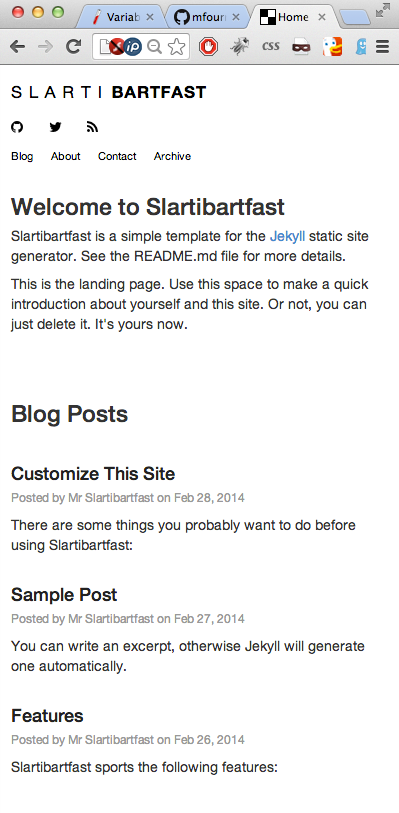

Slartibartfast
===

Slartibartfast is a simple, whitespace oriented template for the [Jekyll](http://jekyllrb.com/) static site generator. It draws inspiration and some components from [holman/left](https://github.com/holman/left) and [maciakl/Sample-Jekyll-Site](https://github.com/maciakl/Sample-Jekyll-Site). 

Requirements
------------

Development time dependencies:

* [Ruby][rb]
* [Gems][gm]
* [Jekyll][jk]
* [Rdiscount][rd] (optional - comment out in `_confing.yaml` to use Maroku)

Run-time dependencies:

* A web server

What to Do
----------

To use this template:

* Clone this repository
* Modify `_config.yaml` with your name, blog title, description and etc...
* Tweak `style.css` and HTML files in `_layouts` to personalize
* Customize the /about/index.html page
* Add your contact information on the /contact/index.html page
* Create blog entries in `_posts/` - work off the sample posts there
* Run `jekyll --server` to generate site locally
* View it by going to `http://localhost:4000` and make sure it looks good
* If all is well, upload contents of `_site` to your server
* Repeat steps 4-7 to update blog

Features
--------

Following features are available:

* Automatically generate a valid RSS feed (see feed.xml in root directory).
* Automatically generate a valid Google Sitemap (see sitemap.xml in root directory).
* Uses Twitter Bootstrap so pages adjust to screen width. Can be used on desktop, tablet, mobile. 
* Tested on Chrome, Firefox, Opera, Safari, Mobile Chrome, Mobile Safari, IE 8. 

Screenshots
-----------

  
 

